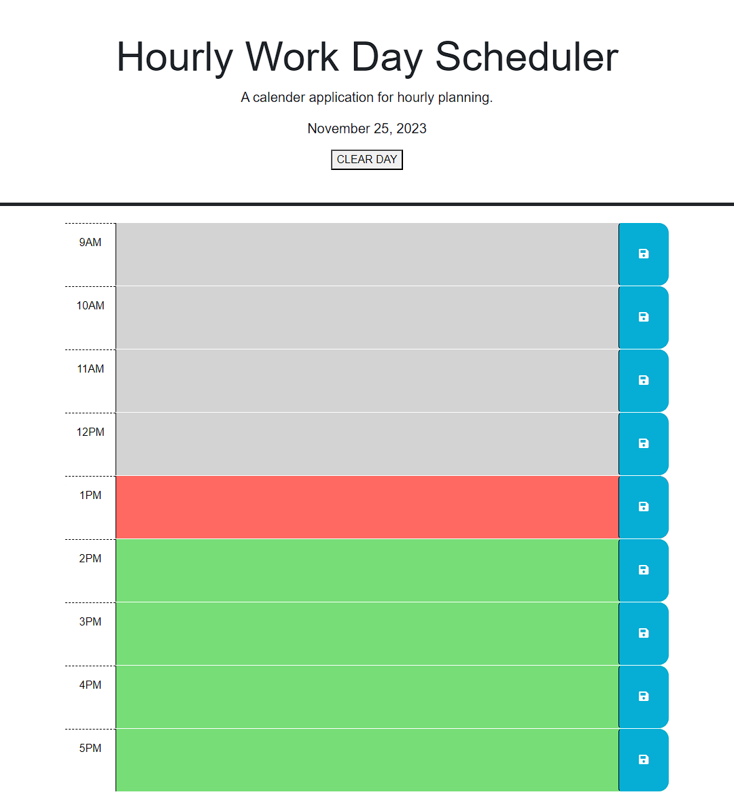

# Hourly Work Day Planner

This is an hourly work planner for each work day. Its structured for a 9-5 work day. Each hour has a section you can add an event for and save it.
This application stays current with the date for you. At the end of every day, you can clear the schedule for the next day.

## Instructions

Add your event within each hour row. Click the save button to the far right to save each entry. To clear the schedule, click the "CLEAR DAY" button at the top of the schedule.

## License

[MIT License](https://choosealicense.com/licenses/mit/)

## Start Preview

